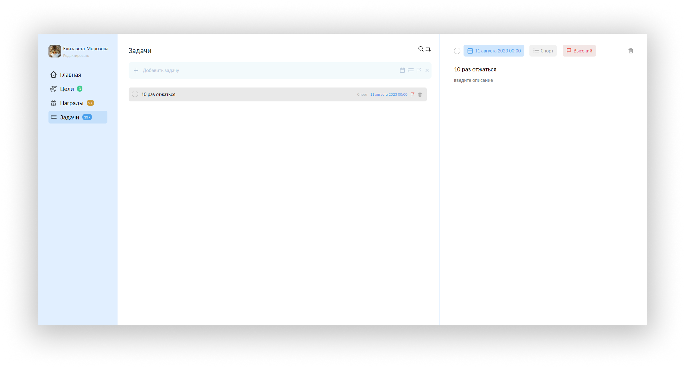

# Front end Pet Project (Course paper)

---

## Preview

## Idea and requirements overview

The idea of the application is to allow users to create tasks, reward and combine them into big goals. Let's describe 3 main entities:
- Task - a small simple thing that user can accomplish. Also it has the following properties: date, priority and list (group of tasks used for filtering).
- Reward - anything that can be rewarding for a user. E.g. 'buy a new phone', 'go to the cinema', 'eat a cake'. User can also upload an image for this entity.
- Goal - combine several tasks and one reward.

Example of the goal:
- Goal name:
	- Get a new job
- Tasks:
	- Learn this thing
	- Learn this thing
	- Practice that
	- Do the mock interview
- Reward:
	- Buy a dog

Use cases:
- Users can create, update, delete and read (CRUD) tasks
- Users can CRUD rewards
- Users can CRUD goals

## Technical overview

From the technical perspective application consists of frontend and backend parts.

Frontend tools:
- javascript
- react
- redux toolkit
- htlm, css, scss
- lodash (for debounce)
- axios
- mui (for date picker component)
- vite (with vite-plugin-svgr for convenient svg usage)

Backend tools:
- node (v18.12.1)
- express
- multer
- multiparty
- sequelize
- sqlite3
- cors